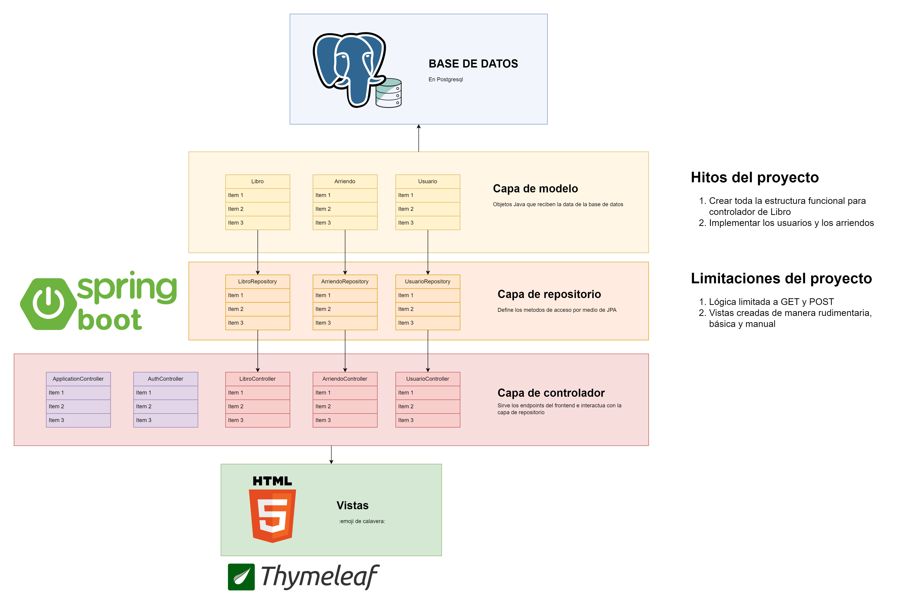
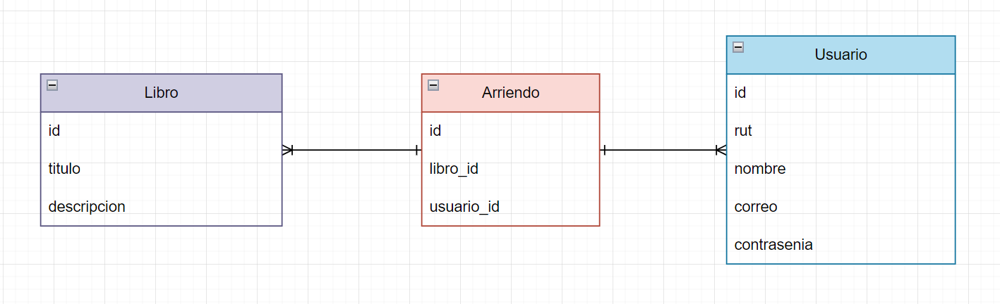

# Repaso del modulo 6

Repaso hecho para poder explicar bien todo el flujo de trabajo con JPA

## Hitos del proyecto

1. Crear toda la estructura funcional para controlador de Libro `¡COMPLETADO!`
2. Implementar los usuarios y los arriendos

## Pasos del proyecto

- Crear el repositorio GIT (No Github)
- Crear la conexión a base de datos
- Hacer un archivo de logs
- Crear un Readme

## Flujo de usuario del proyecto HITO 1

1. El usuario llega al index
2. Aprieta el botón de [CREAR LIBRO]
3. Llena el formulario
4. Es redirigido al index para ver los libros creados
5. Hace clic en el nombre del libro
6. Se le muestra un modal con los detalles de libro

## Estructura general del proyecto



## Flujo de datos del proyecto



## Instrucciones adicionales

Nombre de la base de datos usada

```sql
CREATE DATABASE db_libreria_repaso;
```

## Observaciones

Las cosas que nos ahorra `@Autowired`

```java
// Crea el objeto `JdbcTemplate` como constante...
private final JdbcTemplate jdbc;

// Asignarlo al constructor de manera manual...
public SaleRepository(JdbcTemplate jdbc){
  this.jdbc = jdbc;
}
```

### Sobre las rutas:

Al trabajar con las rutas de *endpoint*, creadas por medio de `@GetMapping`, `@PostMapping`, `@RequestMapping` se utiliza "/" al inicio de las rutas

#### Por ejemplo

```html
<form th:action="@{/libros/nuevo}">
```

Mientras que los que trabajan con *archivos estáticos* no lo llevan

#### Por ejemplo

```java
return "libros/form"; // Esto lleva a Repaso_modulo_seis\src\main\resources\templates\libros\form.html
```

## Pendientes (Respondidas por el profesor)

- La sobre escritura de metodos por `ApplicationController` da error
  - **R:** Los conceptos de Rails no son aplicables a Springboot
- No es posible obtener los archivos CSS y JS desde `/static`
  - **R:** Se usa la notación de Thymelaf `th:href="@{/css/style.css}"`
- Dificultad al momento de mandar las alertas y al mismo tiempo servir la lista de libros debido a se usan vistas separadas y no modales para el formulario
  - **R:** Se utilizan `ModelAndView` en el método GET y un retorno `String` en el método del SERVICIO para hacer comprobaciones en el controlador. Ver carpeta `/pictures`
- Hacer que funcione el modal o reemplazarlo por una vista detalle separada
  - **R:** Aplicar Javascript...
- Confirmar si la siguiente línea de código es correcta o existen alternativas mejores
```java
// Método antiguo
@Query(value = "SELECT * FROM libro ORDER BY id DESC", nativeQuery = true)
List<Libro> findAll();

// Método moderno 
@Query("SELECT * FROM libro ORDER BY id DESC")
List<Libro> findAll();
```
  - **R:** Existen mejores alternativas como `findAllOrderByIdAsc()`. Un método integrado de JPA

## Investigar

- Que hace `.table-group-divider` para Bootstrap
  - Solo pone un borde grueso...
  ```css
  .table-group-divider {
    border-top: calc(var(--bs-border-width) * 2) solid currentcolor;
  }
  ```
<br>

> ✨ アイ-カツ! アイ-カツ! ✨