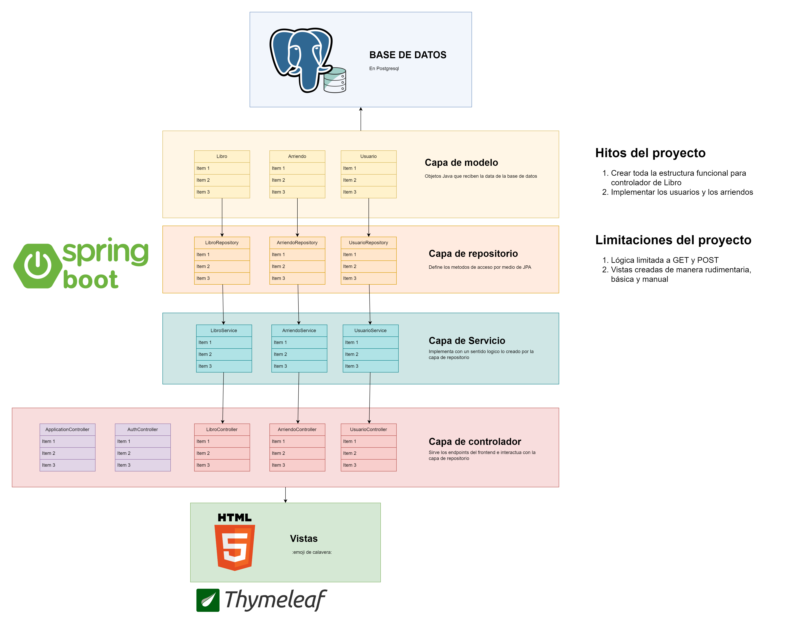

# Repaso del modulo 6

Repaso hecho para poder explicar bien todo el flujo de trabajo con JPA

## Hitos del proyecto

1. Crear toda la estructura funcional para controlador de Libro `<- VAMOS AQUI`
2. Implementar los usuarios y los arriendos

## Pasos del proyecto

- Crear el repositorio GIT (No Github)
- Crear la conexión a base de datos
- Hacer un archivo de logs
- Crear un Readme

## Flujo de usuario del proyecto HITO 1

1. El usuario llega al index
2. Aprieta el botón de [CREAR LIBRO]
3. Llena el formulario
4. Es redirigido al index para ver los libros creados
5. Hace clic en el nombre del libro
6. Se le muestra un modal con los detalles de libro

## Estructura general del proyecto



## Flujo de datos del proyecto


## Instrucciones adicionales

Nombre de la base de datos usada

```sql
CREATE DATABASE db_libreria_repaso;
```

## Curiosidades

Las cosas que nos ahorra `@Autowired`

```java
// Crea el objeto `JdbcTemplate` como constante...
private final JdbcTemplate jdbc;

// Asignarlo al constructor de manera manual...
public SaleRepository(JdbcTemplate jdbc){
  this.jdbc = jdbc;
}
```

## Pendientes

- La sobre escritura de metodos por `ApplicationController` da error
- No es posible obtener los archivos CSS y JS desde `/static`
- Dificultad al momento de mandar las alertas y al mismo tiempo servir la lista de libros

## Investigar

- Que hace `.table-group-divider` para Bootstrap

## Observaciones

### Sobre las rutas:

Al trabajar con las rutas de *endpoint*, creadas por medio de `@GetMapping`, `@PostMapping`, `@RequestMapping` se utiliza "/" al inicio de las rutas

#### Por ejemplo

```html
<form th:action="@{/libros/nuevo}">
```

Mientras que los que trabajan con *archivos estáticos* no lo llevan

#### Por ejemplo

```java
return "libros/form"; // Esto lleva a Repaso_modulo_seis\src\main\resources\templates\libros\form.html
```